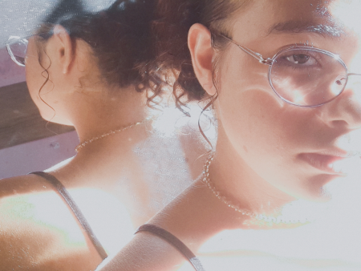

<!DOCTYPE html>
<html lang="pt-BR">
<head>
    <meta charset="UTF-8">
    <meta name="viewport" content="width=device-width, initial-scale=1.0">
    <title>Meu Primeiro Dia</title>

    <link rel="shortcut icon" href="icon/favicon.ico" type="image/x-icon">
    <link rel="stylesheet" href="style.css">
</head>

<body>

    <audio controls autoplay loop>
        <source src="AUDIO/ana.mp3" type="audio/mpeg">
        Seu navegador não suporta áudio.
    </audio>

    <h1 style="background-color: rgb(149, 226, 190); color: black;">
        As vozes do meu coração!
    </h1>

    

        Será que fiquei louco por pensar em amor? 
        Talvez eu sempre tenha desejado esse encontro silencioso da alma.
    

    <h2 style="background-color: rgb(233, 204, 125); color: black;">
        Com as Cores de um Jardim
    </h2>

    

        “As cores foram surgindo em um dia qualquer, 
        fosse um domingo ou uma quinta-feira. 
        No lírio dos seus olhos, percebi que fui e ainda sou extremamente feliz. 
        Acho que estou sonhando acordado.”
    

    <h3 style="background-color: rgb(228, 151, 211); color: black;">
        A minha Flor?
    </h3>

    

    <h4 style="background-color: rgb(65, 134, 173); color: black;">
        Ah O AMOR, será que existe?
    </h4>

    

        Com os dias no seu ápice ficou tão belo e ao mesmo tempo tão gelado, 
        gélido como a forma que ficam minhas mãos ao vê-la, acho que estou nervoso? 
        <strong>COMO? estou doente?</strong>
        Se o sonho de ser amado é isso, quero que nunca acabe. 
        <strong>EU ME SINTO VIVO....</strong>
    

    <h5 style="background-color: rgb(209, 151, 151); color: black;">
        Formando Sentimentos...
    </h5>

    

        A forma de me expressar está sendo tão rápida? 
        Acho que sou emocionado demais ou só intenso ao seu ápice, 
        mas se não for para ser assim, do que adianta amar? 
        Se o amor é tão intenso, por que não posso ser assim? 
        Vejo que devo me conter para não machucá-la ou me machucar... 
        Com os dias se tornando noite ao piscar de olhos, será que vou perdê-la?
    

    <h6 style="background-color: rgb(110, 186, 230); color: black;">
        Desabafo ou só um pensamento...
    </h6>

    

        Meu crime foi sentir tudo muito profundo, 
        meu castigo foi sobreviver...
    

    <section>
        <h2 style="background-color: rgb(144, 96, 175); color: black;">
            Meu Sol!?
        </h2>

        

            Ahh o sol, tão lindo, tão quente e tão intenso,
            vejo que consigo me apaixonar por tudo nele, 
            mas será que eu não irei me queimar se eu me aproximar? 
            Mas se ele tiver cuidado comigo, consigo me acostumar a amá-lo. 
            E se não for para mim? 
            Não sei... Queria uma confirmação...
        

    </section>

    <section>
        <h2 style="background-color: rgb(188, 221, 240); color: black;">
            Jardim das Flores
        </h2>

        

            Fui, em meio ao calor dos meus anseios, 
            procurar uma flor perdida no jardim.  

            Entre tantas cores e perfumes, 
            colhi a mais bela, 
            a mais charmosa, 
            aquela que parecia nascer da própria primavera.  

            Ela carregava encantos nos olhos 
            e leveza no sorriso, 
            enquanto eu caminhava desajeitado, 
            vestido de dúvidas e descuidos.  

            "Preciso mudar", 
            sussurrei ao vento, 
            acreditando não ser digno 
            de tamanha beleza.  

            Mas, por algum motivo, 
            ela me escolheu.  

            E foi em seu olhar 
            que encontrei a verdade que me faltava: 
            eu não era pouco, 
            não era vazio, 
            não era um homem sem valor.  

            Eu apenas estava perdido, 
            como uma flor que floresce tarde, 
            esperando a estação certa 
            para revelar quem realmente é.
        

    </section>

</body>
</html>
